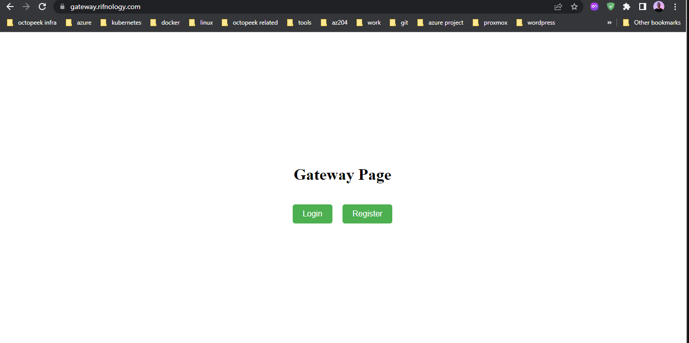
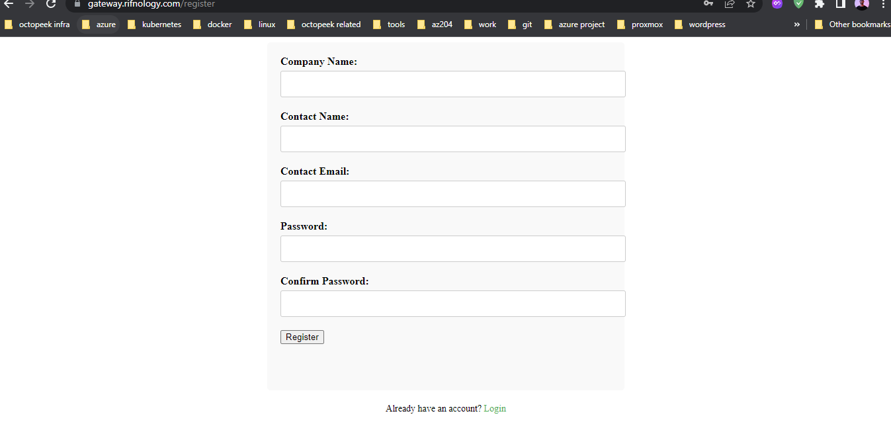
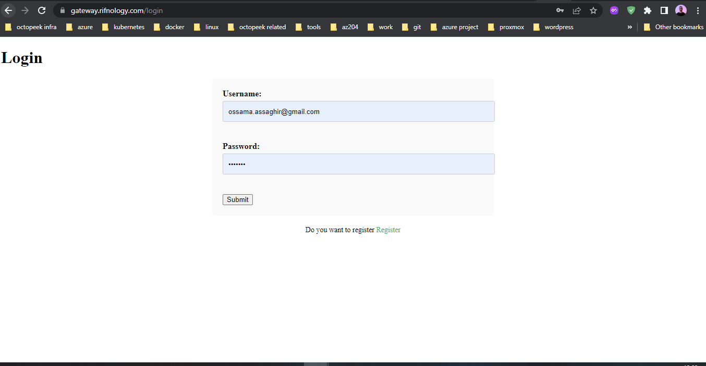
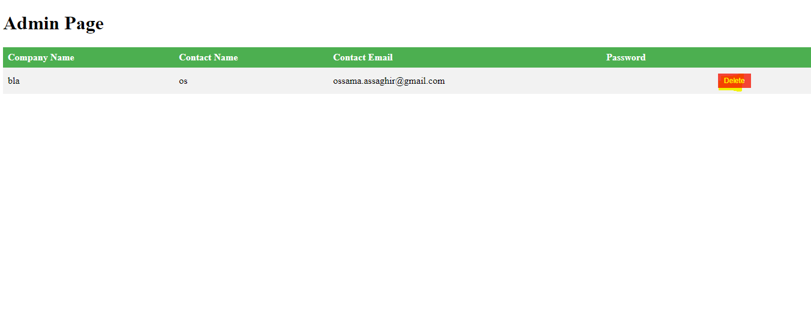

# Gateway-App

# To Test the app 
URL : https://gateway.rifnology.com/

to register a new client : https://gateway.rifnology.com/register

to login with new client : https://gateway.rifnology.com/login

to Delete clients : https://gateway.rifnology.com/admin



# to create a user : 

```
curl -X 'POST' \
'https://{companyname}.rifnology.com/api/users/registration' \
-H 'accept: application/json' \
-H 'Content-Type: application/json' \
-d '{
"name": "Jhon Doe",
"email": "example@mail.mail",
"role": "Admin",
"status": "Active",
"password": "password"
}'

```
